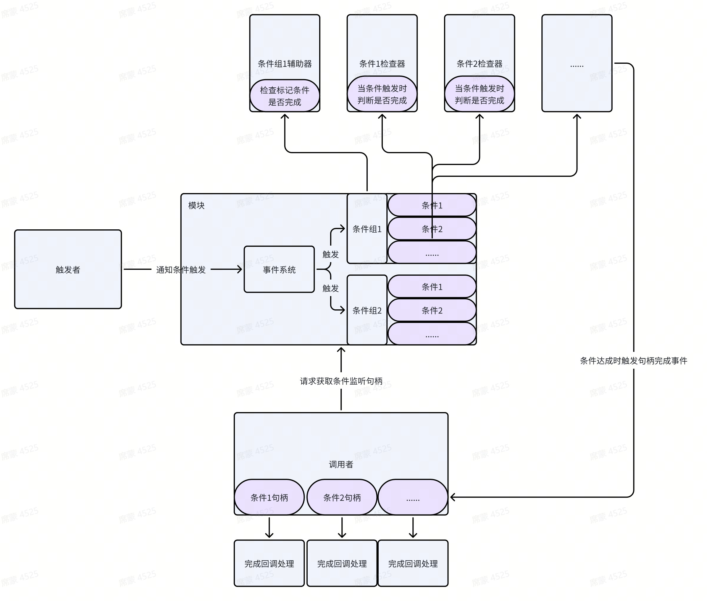

**1.** **类型管理**

程序中很多灵活高级的实现都需要类型和反射来处理，此模块管理了需要使用的类型并提供一些优化过的方法。

例如需要迭代所有UI类(假设所有UI类都有共同的基类或接口)，只需要 ->

```C#
TypeSystem typeSys = TypeModule.GetOrNew<IUI>();
foreach(Type type in typeSys)
{
  // 迭代所有UI类型IConditionGroupHandle handle = ConditionModule.Register(LevelSetting); //注册等级条件

handle.OnComplete(() =>
{
  //检查等级执行相应动作
});
}
```

此模块还提供了获取标记有相关特性(Attribute)的类型，假如要获取所有实现了TestAttribute的类型 ->

```c#
TypeSystem typeSys = TypeModule.GetOrNewWithAttr<TestAttribute>();
foreach(Type type in typeSys)
{
  // 迭代所有标记了TestAttribute的类型
}
```

此模块还提供了获取某个类型特性的优化方法，一般情况下获取某个类型的Attribute需要调用Type的GetAttribute，但此方法频繁调用会产生较高的GC(内部实现会生成一个临时数组，并迭代比较)，模块提供了一个优化的GetAttribute方法，不会产生额外GC。

```c#
TestAttribute attr = TypeModule.GetAttribute<TestAttribute>(typeof(Test));
```

此模块还提供了优化过的创建对象的方法，一般创建反射类型对象需要调用Acitivator.CreateInstance，但在一些频繁创建对象的情况下会产生GC，模块提供了优化方法不会产生额外GC。

```c#
TestClass inst = TypeModule.CreateInstance<TestClass>();
```

此模块提供了一个接口，用于确定需要管理的类型，可自由实现扩展。

```c#
public interface ITypeCheckHelper
{
  string[] AssemblyList { get; } //需要管理的程序集集合
  bool CheckType(Type type); //检查是否需要剔除需要的类型
}
```

**2.** **数据存档管理**

所有存档都实现IArchive接口，所有存档有ArchiveModule模块管理，此模块实现了ISaveable接口，可自由调配保存存档的时机，例如在Unity的OnApplicationFocus生命周期触发时保存 ->

```c#
void OnApplicationFocus(bool focus)
{
  Entry.Trigger<ISaveable>();
}
```

此外存档还可使用加密模块对数据加密，可自由选择是否加密。模块还提供了一个用于控制写入数据方式的接口IArchiveUtilityHelper，可以实现该接口用于控制写入地址，默认使用System.IO下的File接口写入存档。

**I.** **二进制存档**

存档结构


文件码可自定义，用来标识文件。文件头存储了文件信息，提高检索文件的效率，文件信息结构如下

```c#
struct FileInfo
{
​    [MarshalAs(UnmanagedType.ByValTStr, SizeConst = 128)]
​    public string Name;
​    public FileType Type;
​    public int FileCount;
​    public long Offset;
​    public int Size;
}
```

存档内部具有文件夹结构，可自由支配，并提供了导入文件夹到存档和导出存档到文件夹的方法 ->

DataArchive.ExportDisk(导出路径);

DataArchive.ImportDisk(导入路径);

DataArchive.Write(内部路径，数据); //将文件写入某个路径下

存档会保存为一个后缀为.bytes的文件，可用于保存到云端，并提供的恢复的接口 ->

DataArchive archive = DataArchive.FromBytes(datas);

**II. CSV****存档**

用于保存以逗号分隔的CSV文本，在需要使用表格存档的情况很适用。CSV解析采用[CSVHelper](https://joshclose.github.io/CsvHelper/)类库解析，高效好用。

**III. JSON****存档** 

用于保存JSON文本，提供了很多常用的接口，并且可以保存自定义类和数组对象，相比于Unity提供的PlayerPrefs更好用。

**3.** **实体管理**

**4.** **数据表管理**

所有数据表类都要实现接口IDataTable，并由数据表模块DataModule管理，所有数据表中的数据类型都要实现IDataRaw接口。模块可处理不同类型的文本，如数据表可以是Json也可以是Csv文件:

```c#
DataModule.Add<DataRaw>("text.json", FILETTYPE.JSON); //Json类型数据表，数据类为DataRaw
DataModule.Add<DataRaw>("text.csv", FILETYPE.CSV); //Csv类型数据表，数据类为DataRaw
```

模块提供了获取整个数据表或单个数据的接口:

```c#
IDataTable<DataRaw> table = DataModule.Get<DataRaw>(); //获取整张数据表
DataRaw data = table.Get(Id); //获取数据表中为Id的数据
```

不同类型的数据由序列化模块SerializeModule处理，并提供了用于扩展的接口ISerializeHelper用于处理不同类型的文件。

**5.** **事件管理**

事件模块管理了所有的事件系统类EventSystem的生命周期，每个事件系统都是独立的，可通过模块请求创建，事件系统提供了常用的方法:

```c#
EventSystem.Trigger(event) 触发事件(下一帧)
EventSystem.TriggerNow(event) 立刻触发事件
EventSystem.Listen(event, handler) 监听事件
EventSystem.Unlisten(event, handler) 移除事件监听
```

**6.** **状态机管理**

有限状态机模块提供状态机的创建和销毁等生命周期:

```c#
IFsm fsm = FsmModule.GetOrNew(状态集合); //请求一个有限状态机
FsmModule.Remove(fsm); //销毁状态机
```

所有的状态都要实现FsmState基类，该类具有所有的状态生命周期事件和一些常用方法:

```c#
FsmState.OnInit //初始化生命周期
FsmState.OnEnter//进入状态生命周期
FsmState.OnUpdate//更新生命周期
FsmState.OnLeave//离开状态生命周期
FsmState.OnDestroy//状态销毁生命周期
FsmState.ChangeState //改变至下一个状态
```

**7.** **国际化管理**

国际化(i18n)提供了多国语言的管理，数据结构采用Csv文件，并使用[CSVHelper](https://joshclose.github.io/CsvHelper/)解析，Csv文件方便编辑，并且解析快速。数据结构如下:

|      | 语言1 | 语言2 | 语言3 |
| ---- | ----- | ----- | ----- |
| Id1  | 翻译1 | 翻译2 | 翻译3 |
| Id2  | 翻译1 | 翻译2 | 翻译3 |

模块提供一些常用接口:

```c#
LocalizeModule.Lang //获取或设置当前语言
LocalizeModule.ExistLangs //查询所有存在的语言
LocalizeModule.GetValue //获取某个翻译
LocalizeModule.GetLine //获取某行翻译
LocalizeModule.GetValueParam //获取具有通配符的翻译
```

模块还提供事件系统，用于发出一些通知:

```c#
LocalizeModule.Event.Listen(LangChangeEvent, Handler); //监听语言改变的事件
```

**8.** **对象池管理**

需要被对象池管理的对象需要实现IPoolObject接口，该接口定义了一些对象池生命周期事件，用于在特定时机收到通知:

```c#
IPoolObject.OnCreate //当从对象池中创建时触发的生命周期
IPoolObject.OnRequest //当从对象池中被请求时触发的生命周期
IPoolObject.OnRelease //当从释放到对象池中时触发的生命周期
IPoolObject.OnDelete //当从对象池中销毁时触发的生命周期
```

模块PoolModule提供了所有类型的对象池管理，需要时请求模块得到对象池

```c#
interface IPool<T> where T : IPoolObject
{
  IPoolHelper Helper { get; }
  T Require();
  void Release(T);
}
T obj = IPool.Require(); //请求对象
IPool.Release(obj) ; //释放对象
```

对象池提供了一个辅助器，用于扩展对象的创建或请求等处理，可自定义实现创建方法，只要在实现类上标记PoolHelper特性:

```c#
[PoolHelper(typeof(Type))] //标记为对象池辅助器
class TestPoolHelper : IPoolHelper //实现辅助器接口
{
  IPoolObject Factory(); //实现自定义创建方法
  ...
}
```

**9.** **资源管理**

提供资源加载和卸载的管理，开放了可扩展的接口IResourceHelper

**10.** **任务管理**

定义了所有任务需要实现的接口ITask，任务模块TaskModule负责管理所有的ITask的创建，执行，更新，销毁。

```c#
interface ITask
{
  bool IsComplete { get; } // 是否完成
  float Pro { get; } //任务进度
  void OnInit(string name); //初始化生命周期
  void OnUpdate(); //更新生命周期
  void OnComplete(Action complete); //完成事件函数
  void Add(ITaskHandler target); //添加任务处理类
  void AddStrategy(ITaskStrategy strategy); //添加任务处理策略
}
```

任务处理类可是具体需要执行的任务，任务处理策略类可以定义具体执行任务的行为。

模块提供一些常用的任务类，如延迟执行，重复执行：

```c#
ActionTask
  .Add(() => {} ) //下一帧执行
  .Add(1, () => {}) //一秒后执行
  .Add(() => { return waitComplete; }) //当waitComplete为true时继续
  .Add(1, () => { return waitComplete; }) //每隔1秒判断一次waitComplete，为true时继续
  .OnUpdate(() => {} ) //任务执行时每帧执行
  .OnComplete(() => {} ); //任务完成时执行
```

**11.** **通用条件监听器模块**

模块封装了一些通用的监听器类，具有条件触发的需求可以使用此模块。例如到达某个等级执行某个事情：

```c#
IConditionGroupHandle handle = ConditionModule.Register(LevelSetting); //注册等级条件
handle.OnComplete(() =>
{
  //检查等级执行相应动作
});
```

模块流程结构:


